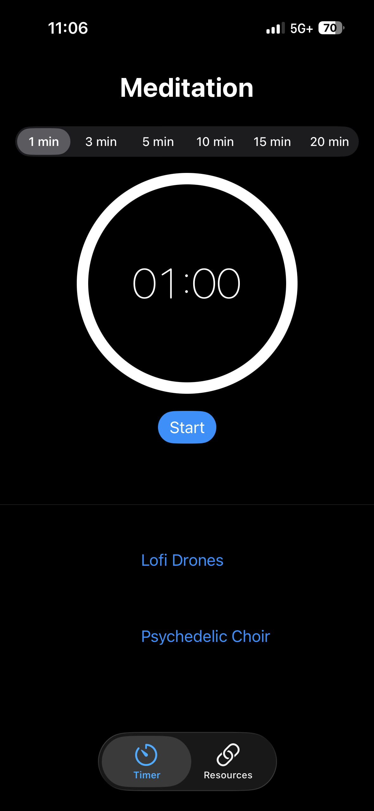
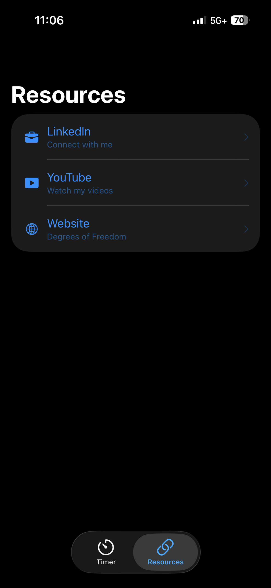

# Degrees of Freedom — Meditation Timer

A SwiftUI iOS app for guided meditation sessions with bundled ambient music, session history, and links to Degrees of Freedom resources.

---

## Screenshots

| Timer | Resources |
|---|---|
|  |  |

---

## Features

- **Meditation timer** with 1, 3, 5, 10, 15, and 20 minute presets
- **Progress ring** that animates as the session counts down
- **Bundled ambient tracks** — no internet required, plays in background and through lock screen
- **Session history** — persisted with SwiftData, shows duration and track played
- **One-time completion chime** when the session ends
- **Auto-restart track** when a session is restarted
- **Resources tab** — links to LinkedIn, YouTube, and the Degrees of Freedom website

---

## Project Structure

```
MeditationTimer/
├── MeditationTimerApp.swift       # App entry point, SwiftData container
├── RootView.swift                 # Tab bar, AudioPlayerManager ownership
├── ContentView.swift              # Timer UI, session save logic, history list
├── TrackListView.swift            # Scrollable list of ambient tracks
├── ResourcesView.swift            # Links to external Degrees of Freedom resources
├── AudioPlayerManager.swift       # AVAudioPlayer wrapper, AVAudioSession setup
├── MeditationTrack.swift          # Track model + sampleTracks catalogue
├── MeditationSession.swift        # SwiftData model for past sessions
├── MeditationLogic.swift          # Pure testable helpers (TimeFormatter, ProgressCalculator, TrackNavigator, ThumbnailURLBuilder)
└── Assets.xcassets/
    ├── AppIcon                    # App icon
    └── [track artwork images]     # One image per ambient track

MeditationTimerTests/
└── MeditationTimerTests.swift     # Unit tests: happy path, adversarial, SwiftData
```

---

## Requirements

- Xcode 15+
- iOS 17+
- No third-party dependencies

---

## Setup

1. Clone the repo and open `MeditationTimer.xcodeproj` in Xcode.
2. Add your audio files (`.m4a` or `.mp3`) to the project, ensuring **"Add to target: MeditationTimer"** is checked.
3. Add matching artwork images to `Assets.xcassets`.
4. Update `sampleTracks` in `MeditationTrack.swift` with your filenames and image names.
5. Select a simulator or connected device and press **Run** (⌘R).

---

## Background Audio

Background and lock-screen playback is enabled via:
- **Background Modes** capability → *Audio, AirPlay, and Picture in Picture*
- `AVAudioSession.sharedInstance().setCategory(.playback)` in `AudioPlayerManager`

---

## Running Tests

Press **⌘U** or go to Product → Test. Tests cover:

- `TimeFormatter` — formatting, negatives, overflow
- `ProgressCalculator` — fractions, divide-by-zero, clamping
- `TrackNavigator` — next/prev, wraparound, empty list
- `MeditationSession` — SwiftData insert/fetch, edge cases

---

## License

© Degrees of Freedom. All rights reserved.
